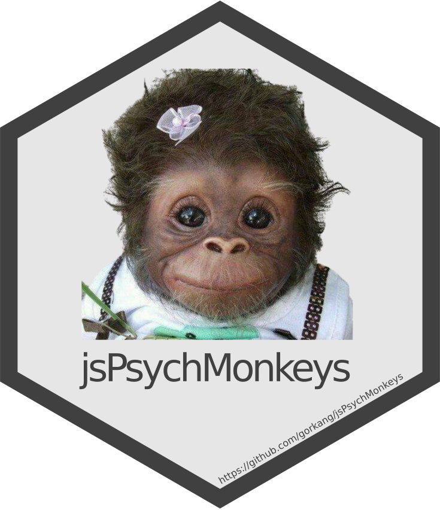
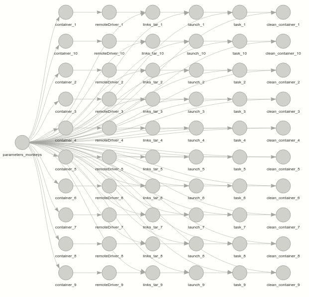

# jsPsychMonkeys 

<!-- badges: start -->
[](https://www.tidyverse.org/lifecycle/#experimental)
<!-- badges: end -->


Release monkeys to a jsPsych experiment using the R package [{targets}](https://github.com/wlandau/targets), docker and [{RSelenium}](https://github.com/ropensci/RSelenium).  

The goal of this package is to simplify testing a jsPysch experiment, generating synthetic responses. With its sister package [jsPsychHelpeR](https://github.com/gorkang/jsPsychHelpeR) you can process the synthetic responses to help catch issues before any actual humans complete the experiment.  

jsPsychMonkeys can run local or online experiments. You can launch as many participants as you want (laws of Physics and time constraints for virtual Monkey's labour still apply), including a parallel horde (your number of CPU cores are the limit). You can also ask the monkeys to take a screenshot of every screen they see, etc.


## How to use it

---  

#### 1) Download the jsMonkeys project

To download this project to your computer:  

```
if (!require('usethis')) install.packages('usethis'); library('usethis')
usethis::use_course("https://github.com/gorkang/jsPsychMonkeys")
```

---  

#### 2) Setup

Install the dependencies (see packages used in `_targets_packages.R`) and make sure you have all the necessary folders:  

`source("setup.R")`  

---  


#### 3) Parameters

Edit the `Parameters` section of the `_targets.R` file. The minimal set of parameters needed are:  

```
parameters_monkeys_minimal = list(
  uid = 1:10, # User id's for the participants. 
  local_folder_tasks = "Downloads/tests/2" # Location of your jsPsych protocol
)
```

---  

#### 4) Release the Monkeys! 

If you want a sequential process: 

- `targets::tar_make()`  

If you want a parallel horde of monkeys: 

- `targets::tar_future_make(workers = 2)`

You can set as many parallel workers as you want. With `targets::tar_make_future(workers = future::availableCores() - 1)` you can have as many workers as your computer cores minus 1.

In `run.R` you can see the typical set of commands needed for a variety of situations.  

---  

10 Monkeys completing a protocol in parallel. You can use `targets::tar_watch(seconds = 10, outdated = FALSE, targets_only = TRUE)` to see the live progress:  





---  

## Other options

---  

#### Launch monkeys on a server

You will need a `.vault/SERVER_PATH.R` file that contains the path where the protocols are located in your server: `server_path = "http://URL_OF_YOUR_SERVER/PROTOCOLS_GENERAL_FOLDER/"`  

With the `server_folder_tasks` you will set the subfolder where the protocol is located. In the example below the monkeys would go to, `http://URL_OF_YOUR_SERVER/PROTOCOLS_GENERAL_FOLDER/1`  

```
parameters_monkeys_minimal = list(
  uid = 1:10, # User id's for the participants. 
  server_folder_tasks = "1" # Location of your jsPsych protocol
)
```

---  

### Other parameters

There are a few parameters that can be useful:  

- `uid_URL = TRUE`: The uid is passed in the URL (e.g. `&uid=1`)  

- `local_folder_tasks = rep("Downloads/tests/test_prototol", 25)`: Passing a vector of multiple tasks will make the monkeys to complete all of them.  

- `keep_alive = TRUE` Keep the docker container alive after completing the tasks  

- `DEBUG = TRUE` Activate DEBUG mode. Lot's of stuff will show up in the console.  

- `open_VNC = TRUE` Activate DEBUG mode and open a VNC container to see the monkey's progress.  

- `screenshot = TRUE` The monkeys will take a picture of all the pages they see. The .png files are stored in `outputs/screenshots`  

- `debug_file = TRUE` Activate DEBUG mode and store all the console output in the `outputs/log`  

- `big_container = TRUE` Sets the Shared memory size (/dev/shm) to 2 gigabytes. This is useful to avoid long/complex protocols to crash
